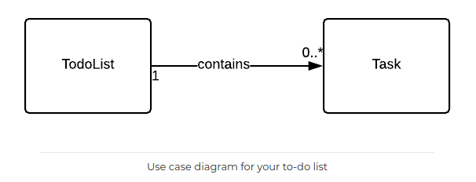

# Todo-list avec NodeJS-Express Postgresql and vue.

Grâce à ces tutos.
https://scotch.io/tutorials/getting-started-with-node-express-and-postgres-using-sequelize
https://blog.jscrambler.com/build-a-task-management-app-using-vue-js-and-a-node-js-backend/
https://github.com/HachemiH/todo-vue-post-to-postgres

## Initialisation du projet.

mkdir postgres-express-node-todolist
`git init` qui initialise le versionning

Créatio de 2 dossiers pour séparer le front du back.

```
cd postgres-express-node-todolist
mkdir back-end front-end
```

## Initialisation du back.

### installation de node.js dans le dossier back.

```
cd back-end
npm init -y
```

le fichier package.json est alors créé.

### Installation d'Express

```
touch .gitignore
code .gitignore
```

fichier qui permet de ne pas intégrer les fichiers node_modules dans les commits.

Dans le fichier copier :
`node_modules/` qui sera alors ignoré par git.

puis `npm i -S express body-parser`
**i** pour **install**
**-S** - pour **--Save** cad sauvegarder express et body-parser dans les dépendances de package.json.
**body-parser** pour analyser et utiliser les paramètres du frontend dans le backend.

### Initialisation d'Express et middleware Morgan & body-parser.

touch app.js

dans le fichier app.js

Création de la dépendance à l'api express

```
const express = require("express");
const logger = require("morgan");
const bodyParser = require('body-parser');
```

Mise en action des modules express à l'appel de l'url.

```
const app = express();
const port = 4000;

// Log requests to the console.
app.use(logger('dev'));

// Parse incoming requests data (https://github.com/expressjs/body-parser)
app.use(bodyParser.json());
app.use(bodyParser.urlencoded({ extended: false }));

// Setup a default catch-all route that sends back a welcome message in JSON format.
app.get('*', (req, res) => res.status(200).send({
  message: 'Welcome to the beginning of nothingness.',
}));

app.listen(port);
```

**Morgan** est un autre middleware d'enregistreur de requêtes HTTP pour Node.js, comme journal de bord automatisé.

### Lancer le serveur à chaque changement avec Nodemon.

créer un dossier **bin** et dans celui-ci un fichier **www.js**

dans app.js supprimer `const port = 4000;` et `app.listen(port);` qui seront maintenant dans bin.
dans app.js ajouter l'export `module.exports = app;`

dans le fichier www.js ajouter le code :

```
// This will be our application entry. We'll setup our server here.
const http = require("http");
const app = require("./app"); // The express app we just created

const port = parseInt(process.env.PORT, 10) || 4000;
app.set("port", port);

const server = http.createServer(app);
server.listen(port);
```

Puis installer Nodemon `npm i -D nodemon`
et

dans package.json

```
"scripts": {
    "start:dev": "nodemon ./bin/www",
    "test": "echo \"Error: no test specified\" && exit 1"
  },
```

et exécuter avec la commande `npm run start:dev`. comme dans le script de package.json.

## Sequelize.

Appelé **sequelize** nous l'installons en tant que Node.js **Object Relational Mapping** (ORM) pour notre base de donnée _postgreSQL_.

Installer **Sequelize** `npm install -g sequelize-cli`.
Créer un fichier `.sequelizerc`

dans le fichier, indiquer les chemins

```
const path = require('path');

module.exports = {
  "config": path.resolve('./config', 'config.json'),
  "models-path": path.resolve('./models'),
  "seeders-path": path.resolve('./seeders'),
  "migrations-path": path.resolve('./migrations')
};
```

Le fichier **config.json** contiendra les paramètres de configuration d'application,
le dossier **migrations** pour les migrations de notre application,
le dossier **models** pour les modèles d'application,
le dossier **seeders** pour généralement des données de départ.

puis exécuter sequelize `npm install --save sequelize pg pg-hstore` et `sequelize init`.
Les dossiers et fichier sont alors créés.

## La base de données

### Création de la base de données.

Dans le terminal :

```
pgcli
\l
```

```
CREATE USER todolistchristmas;
\du
```

```
CREATE DATABASE todolchristmas;
\l
```

```
ALTER DATABASE todolistchristmas OWNER TO todolistchristmas;

ALTER USER todolistchristmas WITH PASSWORD 'lavieestbelle';
\q
```

```
pgcli -U todolistchristmas;
\conninfo
```

### Création d'une table.

dans le terminal dans la base de données **todolistchristmas** :

```
CREATE TABLE Items (
 id bigserial not null primary key,
 item varchar(200));
```

`select * from "items";`
la table items apparaît en colonne id et item.

### Création d'une donnée.

`INSERT INTO Items(item) VALUES('bonjour');`

`select * from "items";`
la table items sous Id, la valeur 1 s'est créé, sous item la valeur bonjour.

### ajouter des colonnes.

```
ALTER TABLE items ADD COLUMN "createdAt" timestamp;
You're about to run a destructive command.
Do you want to proceed? (y/n): y
Your call!
ALTER TABLE
Time: 0.008s
```

```
ALTER TABLE items ADD COLUMN "updatedAt" timestamp;
You're about to run a destructive command.
Do you want to proceed? (y/n): y
Your call!
ALTER TABLE
Time: 0.004s
```

`select * from "items";`
la table items sous Id, la valeur 1 s'est créé, sous item la valeur bonjour.

## Mettre à jour les informations de ma base de données dans config.json.

```
{
  "development": {
    "username": "todolistchristmas",
    "password": "lavieestbelle",
    "database": "todolistchristmas",
    "host": "127.0.0.1",
    "dialect": "postgres",
    "operatorsAliases": false
  },
  "test": {
    "username": "todolistchristmas",
    "password": "lavieestbelle",
    "database": "todolistchristmas",
    "host": "127.0.0.1",
    "dialect": "postgres",
    "operatorsAliases": false
  },
  "production": {
    "username": "todolistchristmas",
    "password": "lavieestbelle",
    "database": "todolistchristmas",
    "host": "127.0.0.1",
    "dialect": "postgres",
    "operatorsAliases": false
  }
}
```

## Mettre à jour app.js et vérifier la connexion.

dans app.js

`const Sequelize = require("sequelize");`

puis pour contrôler la connexion avec la base de donnée.

```
const db = new Sequelize(
  "todolistchristmas",
  "todolistchristmas",
  "lavieestbelle",
  {
    host: "localhost",
    dialect: "postgres"
  }
);

db.authenticate()
  .then(() => {
    console.log("Connection has been established successfully.");
  })
  .catch(err => {
    console.error("Unable to connect to the database:", err);
  });
```

## Générer des modèles et leur migration vers la base de données.

Les modèles représentent la base de données. Dans "Todo" il peux y avoir plusieurs "TodoItems", à l'inverse, un "TodoItem" est rattaché à un seul "Todo".
On appelle cette relation One-to-Many.



dans le terminal

`sequelize model:create --name Todo --attributes title:string`

dans les dossiers **models** et **migrations** des fichiers "todo.js" et "20200103083401-create-todo.js" sont alors créés.

puis

`sequelize model:create --name TodoItem --attributes content:string,complete:boolean`

dans les dossiers **models** et **migrations** des fichiers "todoitem.js" et "20200103084953-create-todo-item.js" sont alors créés.

par convention, nous modifions les nom des fichers en mettant la 1ère lettre en majuscule dans model "Todo.js" et "TodoItem.js".

puis dans todo.js
on associe la Todo à ses "TodoItems" en codant :

dans la fonction `const Todo = sequelize.define("Todo", {}`
pour indiquer qu'une valeur dans "title" est obligatoire

```
title: {
      type: DataTypes.STRING,
      allowNull: false,
    },
  });
```

`allowNull: false` à rajouter aussi dans la migration.

et dans la fonction `Todo.associate = function(models) {`

```
Todo.hasMany(models.TodoItem, {
      foreignKey: "todoId",
      as: "todoItems"
    });
  };

  return Todo;
```

puis dans todoitem.js

dans la fonction `const TodoItem = sequelize.define("TodoItem", {}`
pour indiquer qu'une valeur dans "content" est obligatoire et "complete" aura une valeur par défault.

```
content: {
      type: DataTypes.STRING,
      allowNull: false,
    },
complete: {
      type: DataTypes.BOOLEAN,
      defaultValue: false,
    },
  });
```

`allowNull : false` et `defaultValue: false` à rajouter aussi dans la migration.

et dans la fonction `TodoItem.associate = function(models) {}`

```
TodoItem.belongsTo(models.Todo, {
      foreignKey: 'todoId',
      onDelete: 'CASCADE',
    });
  };

  return TodoItem;
```

dans la migration de TodoItem, ajouter aussi la relation car sequelize n'a pas crée de todoId.

```
todoId: {
        type: Sequelize.INTEGER,
        onDelete: 'CASCADE',
        references: {
          model: 'Todos',
          key: 'id',
          as: 'todoId',
        },
```

## Créer des controleurs **"controllers"** et route **"routing"**.

Ils vont servir à créer, éditer, actualiser et supprimer les todos et items.

### Créer pour la todo.

créer un dossier :
`mkdir controllers`
créer dans "controllers" un fichier **todos.js** indiquer la route handler Express vers le modèle correspondant.

```
const Todo = require('../models').Todo;

module.exports = {
  create(req, res) { // route handler
    return Todo
      .create({
        title: req.body.title,
      })
      .then(todo => res.status(201).send(todo))
      .catch(error => res.status(400).send(error));
  },
};
```

Dans "controllers" créer un fichier **index.js** pour gérer tous les exports tous les exports

```
const todos = require("./todos");

module.exports = {
  todos
};
```

Créer un dossier :
`mkdir routes` et et son fichier index.js puis dans celui-ci coder les routes **app.get** et **app.post** :

```
const todosController = require("../controllers").todos;

module.exports = app => {
  app.get("/api", (req, res) =>
    res.status(200).send({
      message: "Welcome to the Todos API!"
    })
  );

  app.post("/api/todos", todosController.create);
};
```

dans app.js, il faudra aussi indiquer ces routes avec un "require" juste avant la fonction.

```
// Require our routes into the application.
require("./routes")(app);
// Setup a default catch-all route that sends back a welcome message in JSON format.
app.get("*", (req, res) =>
  res.status(200).send({
    message: "Welcome to the beginning of nothingness."
  })
);

module.exports = app;
```

### Lister pour la todo.

Dans controllers/todos.js, ajouter la méthode **list**.

```
list(req, res) {
  return Todo
    .findAll()
    .then(todos => res.status(200).send(todos))
    .catch(error => res.status(400).send(error));
},
```

et la route correspondante dans routes/index.js
`app.get('/api/todos', todosController.list);`
